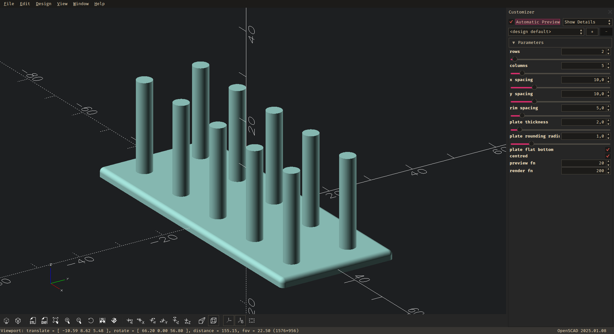

# 900M Tip Holder

This is a repo for a simple OpenSCAD script to generate a 900M soldering tip holder.

You can use the OpenSCAD customizer to change the number of rows and columns, as well as their spacing and the thickness and rounding of the plate.

This script is dependent on Iriv-Devs Round-Anything library, so do not forget to initialize the submodule.
